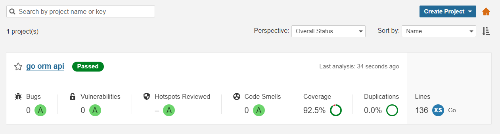

# Simple Go API implementing clean architecture, using Mux, Go ORM and Prometheus

[](https://blackdevs.semaphoreci.com/projects/go-orm-api-clean-arch)

## Running with docker compose

```bash
docker-compose up -d mysql
docker-compose logs -f --tail 100 mysql

docker-compose up -d --build go-orm-api
docker-compose logs -f --tail 100 go-orm-api
```

## Code coverage

It was used Sonarqube to gather the coverage for unit tests.



Run sonarqube scan:
```bash
cd quality-gate && bash run.sh
```
